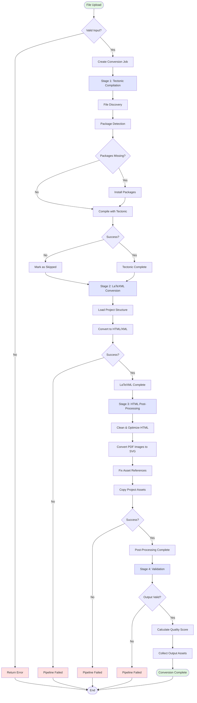

# 🏗️ Architecture Documentation

## Table of Contents
- [System Overview](#system-overview)
- [High-Level Architecture](#high-level-architecture)
- [Conversion Pipeline](#conversion-pipeline)
- [Component Interactions](#component-interactions)
- [Coding Guardrails](#coding-guardrails)

---

## System Overview

The LaTeX → HTML5 Converter is a FastAPI-based web service that transforms LaTeX documents into clean, web-compatible HTML5 with ≥95% fidelity. The system uses a multi-stage pipeline approach combining multiple LaTeX processing tools to achieve optimal conversion quality.

### Design Principles

1. **Fault Tolerance**: Graceful degradation with fallback mechanisms at each stage
2. **Progressive Enhancement**: Multi-stage pipeline with incremental quality improvements
3. **Separation of Concerns**: Clear boundaries between compilation, conversion, and post-processing
4. **Centralized Configuration**: All operational parameters managed through settings
5. **Async-First**: Non-blocking operations for scalability and responsiveness

### Core Capabilities

- **Multi-format Input**: ZIP archives, standalone .tex files, or full LaTeX projects
- **Intelligent Discovery**: Automatic detection of main files, dependencies, and custom classes
- **Package Management**: Auto-detection and installation of missing LaTeX packages
- **Asset Conversion**: PDF images → SVG, optimal web formats
- **Real-time Progress**: WebSocket-free polling-based progress tracking
- **Quality Scoring**: Automated fidelity assessment of conversion results

---

## High-Level Architecture

### System Layers

```
┌─────────────────────────────────────────────────────────────┐
│                      Presentation Layer                      │
│  - Web UI (Jinja2 Templates)                                │
│  - REST API Endpoints (FastAPI)                             │
│  - Static File Serving                                      │
└─────────────────────────────────────────────────────────────┘
                            ↓
┌─────────────────────────────────────────────────────────────┐
│                      Application Layer                       │
│  - Conversion Pipeline Orchestrator                         │
│  - Job Management & Progress Tracking                       │
│  - Asset Conversion Coordination                            │
└─────────────────────────────────────────────────────────────┘
                            ↓
┌─────────────────────────────────────────────────────────────┐
│                        Service Layer                         │
│  ┌──────────────┐  ┌──────────────┐  ┌──────────────┐      │
│  │   Tectonic   │  │   LaTeXML    │  │ HTML Post-   │      │
│  │   Service    │  │   Service    │  │  Processor   │      │
│  └──────────────┘  └──────────────┘  └──────────────┘      │
│                                                              │
│  ┌──────────────┐  ┌──────────────┐  ┌──────────────┐      │
│  │    File      │  │   Package    │  │    Asset     │      │
│  │  Discovery   │  │   Manager    │  │  Conversion  │      │
│  └──────────────┘  └──────────────┘  └──────────────┘      │
└─────────────────────────────────────────────────────────────┘
                            ↓
┌─────────────────────────────────────────────────────────────┐
│                      Infrastructure Layer                    │
│  - File System Operations                                   │
│  - External Tool Integration (latexmlc, pdflatex, dvisvgm) │
│  - Configuration Management                                 │
│  - Logging & Diagnostics                                    │
└─────────────────────────────────────────────────────────────┘
```

### Key Components

#### 1. **Conversion Pipeline** (`app/services/pipeline.py`)
- Orchestrates the complete conversion workflow
- Manages job lifecycle (create, execute, cancel, cleanup)
- Coordinates all service interactions
- Thread-safe job tracking with RLock
- Progress calculation and reporting

#### 2. **Service Components**

**Tectonic Service** (`app/services/pdflatex.py`)
- Compiles LaTeX to PDF using Tectonic compiler
- Validates LaTeX syntax and structure
- Optional stage with fallback to LaTeXML-only

**LaTeXML Service** (`app/services/latexml.py`)
- Converts LaTeX to HTML/XML using LaTeXML
- Handles custom document classes and packages
- Supports preloading of commonly used modules
- Command generation with caching support

**HTML Post-Processor** (`app/services/html_post.py`)
- Cleans and optimizes HTML output
- Converts PDF images to SVG format
- Fixes asset references and paths
- Inlines critical CSS and JavaScript

**File Discovery Service** (`app/services/file_discovery.py`)
- Extracts and analyzes LaTeX project structure
- Identifies main .tex file in multi-file projects
- Detects dependencies and custom classes
- Maps supporting files and assets

**Package Manager Service** (`app/services/package_manager.py`)
- Detects required LaTeX packages from source
- Checks package availability on system
- Auto-installs missing packages via tlmgr
- Handles installation failures gracefully

**Asset Conversion Service** (`app/services/assets.py`)
- Converts PDF images to web-compatible SVG
- Handles image format transformations
- Optimizes asset delivery

#### 3. **API Layer** (`app/api/`)

**Conversion API** (`app/api/conversion.py`)
- File upload and conversion initiation
- Job status and progress queries
- Download endpoints for results
- Background cleanup thread management

**Health API** (`app/api/health.py`)
- Service health checks
- Tool availability validation
- Dependency status reporting

#### 4. **Configuration Management** (`app/config.py`, `app/configs/`)
- Centralized settings with environment variable support
- Pydantic-based validation
- Service-specific configurations (LaTeXML, Tectonic)
- Security settings and constraints

---

## Conversion Pipeline

### Pipeline Workflow



### Pipeline Stages

#### Stage 1: Tectonic Compilation
**Purpose**: Validate LaTeX syntax and compile to PDF

**Steps**:
1. Extract project files from ZIP (if applicable)
2. Discover main .tex file and dependencies
3. Detect required LaTeX packages
4. Check package availability
5. Install missing packages (auto)
6. Compile with Tectonic compiler

**Outputs**: PDF file (optional), validation report
**Fallback**: Skip stage and continue with LaTeXML-only if failed

#### Stage 2: LaTeXML Conversion
**Purpose**: Convert LaTeX to HTML/XML

**Steps**:
1. Load project structure from metadata
2. Configure LaTeXML with custom classes/packages
3. Execute LaTeXML conversion
4. Generate HTML/XML output

**Outputs**: Raw HTML/XML file with MathML
**Critical**: Must succeed for pipeline to continue

#### Stage 3: HTML Post-Processing
**Purpose**: Clean, optimize, and enhance HTML output

**Steps**:
1. Parse and clean HTML structure
2. Identify PDF images in img tags
3. Convert PDF images to SVG format
4. Update asset references to converted formats
5. Copy project assets to output directory
6. Handle filename collisions with subdirectory preservation
7. Inline critical CSS and JavaScript

**Outputs**: Final HTML file, converted assets
**Enhancement**: Improves web compatibility and rendering

#### Stage 4: Validation
**Purpose**: Verify output quality and completeness

**Steps**:
1. Check output file exists and non-empty
2. Collect all asset files (SVG, PNG, CSS)
3. Calculate quality score based on metrics
4. Generate conversion report

**Outputs**: Quality score, asset manifest, completion status

### Progress Tracking

**Job States**:
- `PENDING`: Job created, awaiting execution
- `RUNNING`: Pipeline execution in progress
- `COMPLETED`: Successfully finished all stages
- `FAILED`: Error occurred during processing
- `CANCELLED`: User-initiated cancellation
- `SKIPPED`: Stage bypassed due to fallback

**Progress Calculation**:
- Overall: (Completed Stages / Total Stages) × 100
- Per-stage: Updated by individual services
- Real-time: Polled via REST API endpoints

---

## Component Interactions

### Request Flow

```
Client (Web UI / API)
    ↓ [Upload LaTeX ZIP]
FastAPI Endpoint (conversion.py)
    ↓ [Create Job]
Conversion Pipeline (pipeline.py)
    ↓ [Execute Stages]
    ├─→ File Discovery Service → [Extract & Analyze]
    ├─→ Package Manager Service → [Install Packages]
    ├─→ Tectonic Service → [Compile PDF]
    ├─→ LaTeXML Service → [Convert to HTML]
    ├─→ HTML Post-Processor → [Clean & Enhance]
    │       ↓
    │   Asset Conversion Service → [PDF to SVG]
    ↓ [Validation]
Conversion Result
    ↓ [Store & Track]
Job Storage (In-Memory Dict)
    ↓ [Return Job ID]
Client
    ↓ [Poll Progress]
FastAPI Endpoint
    ↓ [Query Job Status]
Job Storage
    ↓ [Return Progress]
Client
    ↓ [Download Result]
FastAPI Endpoint
    ↓ [Serve ZIP]
File System
```

### Data Flow

1. **Input Processing**:
   - Upload → Temporary Storage → Extraction → Structure Analysis

2. **Conversion Pipeline**:
   - LaTeX Files → Tectonic (PDF) → LaTeXML (HTML) → Post-Processing (Enhanced HTML)

3. **Asset Management**:
   - Project Assets → Discovery → Copying → Conversion (PDF→SVG) → Final Output

4. **Result Delivery**:
   - Output Directory → ZIP Archive → Download Stream → Client

---

## Coding Guardrails

### Mandatory Rules

#### 1. **Configuration Management**
- ✅ ALWAYS use centralized settings from `app/config.py`
- ❌ NEVER hardcode paths, timeouts, or operational parameters
- ✅ ALWAYS use environment variables for deployment-specific values
- ❌ NEVER commit secrets or sensitive data

#### 2. **Error Handling**
- ✅ ALWAYS use custom exception classes for domain errors
- ✅ ALWAYS log errors with context (job_id, stage, details)
- ✅ ALWAYS implement fallback mechanisms for non-critical failures
- ❌ NEVER let exceptions bubble up without logging
- ❌ NEVER suppress errors without user notification

#### 3. **Resource Management**
- ✅ ALWAYS clean up temporary files after processing
- ✅ ALWAYS use context managers for file operations
- ✅ ALWAYS implement timeouts for external tool execution
- ❌ NEVER leave orphaned processes or file handles
- ❌ NEVER exceed configured resource limits

#### 4. **Thread Safety**
- ✅ ALWAYS use locks (RLock) when accessing shared job storage
- ✅ ALWAYS make state updates atomic
- ❌ NEVER access mutable shared state without synchronization
- ❌ NEVER assume single-threaded execution

#### 5. **Type Safety**
- ✅ ALWAYS use type annotations for function signatures
- ✅ ALWAYS use Pydantic models for data validation
- ✅ ALWAYS validate input at API boundaries
- ❌ NEVER trust user input without validation
- ❌ NEVER skip return type annotations

#### 6. **File Operations**
- ✅ ALWAYS use Path objects from pathlib
- ✅ ALWAYS check file existence before operations
- ✅ ALWAYS handle filename collisions gracefully
- ❌ NEVER use string concatenation for paths
- ❌ NEVER overwrite files without collision handling

#### 7. **External Tool Integration**
- ✅ ALWAYS validate tool availability at startup
- ✅ ALWAYS capture stdout/stderr for debugging
- ✅ ALWAYS implement timeout limits
- ✅ ALWAYS handle tool failure gracefully
- ❌ NEVER assume tools are available
- ❌ NEVER ignore exit codes

#### 8. **Logging**
- ✅ ALWAYS log stage transitions with job_id
- ✅ ALWAYS use structured logging with context
- ✅ ALWAYS log warnings for non-fatal issues
- ❌ NEVER log sensitive data (file contents, secrets)
- ❌ NEVER use print() for debugging in production code

#### 9. **API Design**
- ✅ ALWAYS return consistent error formats
- ✅ ALWAYS include request IDs for traceability
- ✅ ALWAYS validate request payloads with Pydantic
- ✅ ALWAYS document endpoints with OpenAPI
- ❌ NEVER expose internal error details to clients
- ❌ NEVER return 500 for validation errors

#### 10. **Code Organization**
- ✅ ALWAYS follow single responsibility principle
- ✅ ALWAYS separate concerns (service/API/model layers)
- ✅ ALWAYS use dependency injection for services
- ❌ NEVER create circular dependencies
- ❌ NEVER mix business logic with API handlers

### Security Guidelines

1. **Input Validation**:
   - Validate file extensions against allowlist
   - Enforce maximum file size limits
   - Sanitize filenames and paths
   - Reject suspicious archive structures

2. **Execution Safety**:
   - Never execute user-provided commands
   - Always use subprocess with explicit arguments
   - Implement timeout limits for all external calls
   - Validate tool outputs before using

3. **File System Access**:
   - Restrict operations to designated directories
   - Prevent path traversal attacks
   - Enforce permissions on temporary directories
   - Clean up sensitive data after processing

4. **Secret Management**:
   - Use environment variables for secrets
   - Validate SECRET_KEY length and randomness
   - Never log or expose credentials
   - Rotate secrets regularly in production

### Performance Guidelines

1. **Async Operations**:
   - Use async/await for I/O-bound operations
   - Avoid blocking the event loop
   - Prefer async file operations when possible

2. **Caching**:
   - Enable LaTeXML binding cache for repeated conversions
   - Cache package availability checks
   - Avoid redundant file system scans

3. **Resource Limits**:
   - Enforce max concurrent conversions
   - Implement job cleanup after retention period
   - Monitor memory usage for large projects

4. **Optimization**:
   - Minimize temporary file creation
   - Use streaming for large file downloads
   - Batch asset operations when possible

### Testing Guidelines

1. **Unit Tests**:
   - Test each service in isolation
   - Mock external tool dependencies
   - Cover error paths and edge cases

2. **Integration Tests**:
   - Test full pipeline execution
   - Verify fallback mechanisms
   - Test with real LaTeX samples

3. **API Tests**:
   - Test all endpoints and status codes
   - Verify error response formats
   - Test concurrent request handling

### Documentation Standards

1. **Code Documentation**:
   - Document all public APIs with docstrings
   - Include parameter types and return values
   - Document raised exceptions
   - Explain complex algorithms

2. **Architecture Updates**:
   - Update this document when adding major features
   - Document new services and components
   - Keep workflow diagrams current

3. **Configuration Changes**:
   - Document new environment variables
   - Update example .env files
   - Note breaking changes in settings

---

## Extending the System

### Adding a New Pipeline Stage

1. Create stage in `_initialize_pipeline_stages()`
2. Implement `_execute_<stage>_stage()` method
3. Update `ConversionStage` enum
4. Add progress tracking
5. Update workflow diagram

### Adding a New Service

1. Create service class in `app/services/`
2. Implement with dependency injection
3. Add configuration to `app/configs/`
4. Register in pipeline initialization
5. Add error handling and logging
6. Write unit tests

### Adding a New API Endpoint

1. Create endpoint in appropriate router
2. Define Pydantic request/response models
3. Add input validation
4. Implement error handling
5. Add to OpenAPI documentation
6. Write API tests

---

## Deployment Considerations

### Docker Container
- Multi-stage build for optimization
- Non-root user for security
- Health check endpoint configured
- Volume mounts for persistence

### Environment Variables
- All settings configurable via env vars
- Validation enforced at startup
- Production mode requires secure SECRET_KEY
- See `.env.example` for reference

### Monitoring
- Health check endpoint: `/api/v1/health`
- Structured logging to stdout
- File-based logs in production
- Job metrics and diagnostics

### Scaling
- Stateless design for horizontal scaling
- Shared storage required for multi-instance
- Job cleanup via background thread
- Consider Redis for distributed job tracking

---

*Last Updated: 2025-12-07*
*Version: 1.0*
